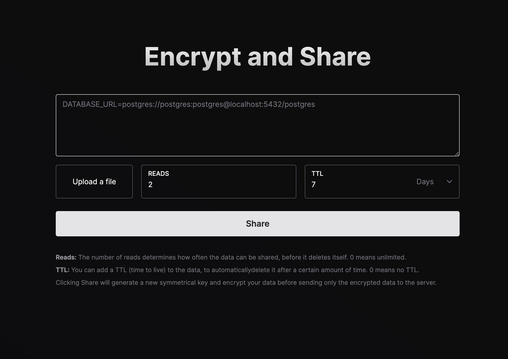

# EnvShare  
**Securely Share Environment Variables**  

[**Visit EnvShare**](https://envshare-puce-one.vercel.app)  

EnvShare is a lightweight and secure tool designed for sharing environment variables safely. Using **AES-GCM** encryption, your sensitive data is encrypted directly in your browser, ensuring the encryption key never leaves your system.  

---

## 🚀 Features  

- **🔗 Shareable Links**: Generate secure links to share your environment variables.  
- **🔒 End-to-End Encryption**: Your data is encrypted using AES-GCM before leaving your browser.  
- **📈 Limited Reads**: Set a maximum number of times the link can be accessed.  
- **⏱ Auto Expiry**: Automatically delete shared data after a specified time.  

---

## 📸 Preview  

  

---

## 🛠 Built With  

- **[Next.js](https://nextjs.org)** – Framework for building fast web applications.  
- **[Tailwind CSS](https://tailwindcss.com)** – Utility-first CSS framework for styling.  
- **[Vercel](https://vercel.com?utm_source=envshare)** – Hosting for deployment.  
- **[Upstash](https://upstash.com?utm_source=envshare)** – Scalable, low-latency database for storing data.  

---

## 📝 How It Works  

1. **Encrypt Data**: Input your environment variables. Encryption happens directly in your browser using AES-GCM.  
2. **Generate Link**: A secure link is created for sharing.  
3. **Control Access**: Set a limit for the number of times the link can be accessed and define an expiration time.  
4. **Share Securely**: Share the generated link with confidence.  

---

## 🖥 Deployment  

EnvShare is deployed on [Vercel](https://vercel.com?utm_source=envshare) and uses [Upstash](https://upstash.com?utm_source=envshare) for storing encrypted data.  

---

## 🙌 Contributing  

Contributions are welcome! If you have ideas, issues, or improvements, feel free to open a pull request or raise an issue in the repository.  

